<div align="center">

#  AIRA

### A credit score for people the banking system cannot see and one that explains itself before anyone lends on it.

**Every credit system assumes the same borrower: someone with a salary slip, a bank history, a credit card. Tens of millions of Bangladeshis have none of that, yet earn, save, and pay reliably every day. AIRA reads that real behavior, turns it into a trust score, explains the reasoning in plain language, and anchors the result so it can be trusted across lenders.**

<p align="center">
  
  
  
  
  
  
  
</p>

<p align="center">
  
  
  
</p>

<p align="center">
  <a href="https://aira-two-rouge.vercel.app/"><strong>🌐 Try AIRA live</strong></a>
</p>

<p align="center">
  <sub>
  <a href="#the-problem">The problem</a> ·
  <a href="#the-approach">The approach</a> ·
  <a href="#what-makes-it-different">What makes it different</a> ·
  <a href="#how-it-works">How it works</a> ·
  <a href="#architecture">Architecture</a> ·
  <a href="#the-scoring-engine">The scoring engine</a> ·
  <a href="#the-two-assistants">The two assistants</a> ·
  <a href="#blockchain-portability">Blockchain</a> ·
  <a href="#real-world-impact">Real-world impact</a> ·
  <a href="#tech-stack">Tech stack</a> ·
  <a href="#known-limitations">Limitations</a> ·
  <a href="#run-it-locally">Run it</a> ·
  <a href="#faq">FAQ</a>
  </sub>
</p>

</div>

<br/>

---

## The problem

Access to formal credit assumes one kind of applicant: someone the system can already see. A salary certificate, a bank statement, a credit card, a paper trail that a lender knows how to read.

A very large number of people do not exist on that trail, and the cost of ignoring them is not abstract.

 🍵 A **tea-stall owner** who takes money all day through bKash, saves a little every week, and has never missed a bill, but has no salary slip to prove any of it.

 🌾 A **seasonal farmer** whose income arrives in two harvest windows a year, which a conventional model reads as "unstable" and rejects.

 🛺 A **street vendor or rickshaw puller** with years of steady mobile-money activity and zero formal financial identity.

 🏪 A **small shopkeeper** turned away not because they are untrustworthy, but because the bank has no way to measure the trust they have already earned.

An estimated **70 million Bangladeshis** are "credit invisible," while formal account ownership sits at only **43.3% of adults**. At the same time, over **239 million Mobile Financial Services accounts** generate billions of transactions a year, a rich record of exactly the reliability lenders want, sitting unused.

The tools that try to fix this share two weaknesses. First, they hand the lender an **opaque number** with no reasons behind it, and the people being scored are the least able to contest a black box. Second, a score built by one provider is **locked to that provider**, so trust earned in one place has to be rebuilt from scratch in the next.

**A score nobody can explain, that nobody else can trust, does not solve financial exclusion. It just relocates it.**

---

## The approach

AIRA is built on three convictions that shape every part of it:

<table>
<tr>
<td width="33%" valign="top">

### 1 · Read behavior, not paperwork
Creditworthiness is inferred from real, consented mobile-money behavior, income regularity, savings, bill discipline, spending patterns, not from documents the borrower will never have.

</td>
<td width="33%" valign="top">

### 2 · Never a black box
Every score is decomposed into human-readable factors with SHAP, and a conversational assistant explains it. The AI supports the human lender's decision; it never replaces it.

</td>
<td width="33%" valign="top">

### 3 · Trust that travels
Each finalized score is anchored on a blockchain ledger, so any participating lender can independently verify it is genuine and unaltered, without a central authority owning the data.

</td>
</tr>
</table>

The result is a scoring tool that is willing to look *less* like magic, showing its reasoning and its limits instead of projecting a confident number, because for the people it serves, that trade is the entire point.

---

## What makes it different

### 1 · Two models, two jobs, not one number doing both

Most alternative-credit tools produce a single score. AIRA deliberately runs **two complementary machine-learning models**, because *predicting* risk and *communicating* it are different tasks.

- A **probability-of-default model** predicts an applicant's likelihood of repayment. This is the predictive credit-risk signal the lender acts on.
- An **interpretable tier model** translates behavior into a simple Bronze / Silver / Gold / Platinum tier and category summary, the motivating, human-readable view shown to the borrower.

One predicts, one explains. Neither is asked to do the other's job.

### 2 · The ML scores, the language model only explains

A deliberate architectural line runs through the whole system: **the credit decision is produced by deterministic ML models, never by the language model.**

XGBoost computes the score; SHAP attributes it to individual features; only *then* does the LLM turn that explanation into plain language. This keeps scoring reproducible and auditable, a requirement for lender trust and regulatory review, and it means the borrower-facing chatbot has nothing sensitive to leak, because it never sees the scoring logic in the first place.

> **The number is math. The words are the language model. The two never swap roles.**

### 3 · Two assistants with two different permission levels

The same underlying model powers two chatbots that are allowed to reveal very different things.

- The **Lender Coach** answers a loan officer's questions from the full score, tier, and SHAP factors, and explains uncertainty, but only ever *supports* the decision.
- The **Borrower Coach** replies in Bangla or English with high-level, non-exploitable tips, and is forbidden from revealing the numeric score, the model weights, the thresholds, or anything that could be used to game the system.

### 4 · Designed against the ways it could be gamed

Because the score affects real lending, the system is built to resist manipulation: statement uploads are checksum/QR-verified against the issuing provider, a minimum transaction history is required before scoring, suspicious patterns (circular transfers, pre-application balance spikes) are flagged for human review rather than auto-approved, and one verified NID is enforced per applicant.

---

## How it works

AIRA runs an application through a clear pipeline, **verify → engineer → score → explain → anchor**, rather than a single opaque "give me a score" call.

```mermaid
flowchart LR
    U["📄 Consented upload<br/>bKash / Nagad statement"] --> V["<b>1 · Verify</b><br/>checksum/QR check<br/>+ NID identity"]
    V --> F["<b>2 · Engineer</b><br/>raw transactions to<br/>13 behavioral features"]
    F --> S["<b>3 · Score</b><br/>XGBoost tier +<br/>default models"]
    S --> E["<b>4 · Explain</b><br/>SHAP factors, then<br/>GPT-5.6 Luna in words"]
    E --> A["<b>5 · Anchor</b><br/>hash on-chain for<br/>cross-lender trust"]
    A --> Out["✅ Trust score + tier<br/>+ explanation + proof"]

    style V fill:#F2E9EF,stroke:#5A3A52,color:#221C18
    style F fill:#F7EEDF,stroke:#B85C38,color:#221C18
    style S fill:#EAF0E7,stroke:#5B7355,color:#221C18
    style E fill:#F2E9EF,stroke:#5A3A52,color:#221C18
    style A fill:#EAF0E7,stroke:#5B7355,color:#221C18
    style U fill:#fff,stroke:#9C9086,color:#221C18
    style Out fill:#fff,stroke:#5A3A52,color:#221C18
```



The borrower sees a tier and simple guidance. The lender sees the full breakdown and the Coach chatbot. The admin verifies identities and reviews fraud flags. Everyone sees only what their role permits.

---

## Architecture

AIRA follows a layered architecture that cleanly separates the user interfaces, the application logic, the machine-learning intelligence, and persistence.

Three client experiences (**Borrower**, **Lender**, **Admin**) sit on a **React** frontend. A stateless **Express.js** backend owns authentication, consent, statement verification, and orchestration. A dedicated **Python FastAPI** service hosts the scoring models and the SHAP explainer, while **GPT-5.6 Luna** (via LangChain) powers the two chatbots. **PostgreSQL** stores users, statements, scores, and consent logs. Two external touch points complete the picture: an **NID e-KYC** service for identity, and a **permissioned blockchain ledger** for score anchoring.

**In short:**

`React → Express API → { FastAPI ML service · GPT-5.6 Luna · Blockchain } → PostgreSQL`

<details>
<summary><strong>⚙️ Engineering decisions worth calling out</strong> (click to expand)</summary>
<br/>

- **The ML service is its own process.** Scoring and SHAP live in a FastAPI service, separate from the Node backend, so the model layer can be tested, retrained, and deployed independently of the business logic.
- **One choke-point for the language model.** Every LLM call flows through a single chatbot service with the mode-specific system prompt, so the borrower and lender assistants cannot drift out of their permission scope.
- **Grounding by whitelist.** The chatbots receive only sanitized, whitelisted fields (score, tier, and the 13 SHAP factors). Anything outside that list is discarded before it reaches the model, so nothing sensitive can leak by accident.
- **Only hashes go on-chain.** The blockchain stores a keccak256 hash of the score plus a pseudonymous address, never raw transactions or identity, so verification is public but the underlying data stays private.
- **The scoring layer is model-agnostic.** XGBoost is the primary model with LightGBM as a comparison; the LLM is configurable through one environment variable, so the provider can be swapped without touching application code.

</details>

---

## The scoring engine

The heart of AIRA is the credit-scoring model, and it is built to be defensible, not just impressive.

**From transactions to features.** Each consented statement is parsed into **13 behavioral features** grouped into income (regularity, average monthly income), discipline (bill-payment count and regularity), financial health (savings ratio, spending-to-income, balance volatility), activity (transaction count and diversity, history length), and risk signals (largest single transaction, circular-transfer flag, balance-consistency check).

**Two gradient-boosted models.** An XGBoost tier model maps those features to a risk tier, and an XGBoost probability-of-default model predicts repayment likelihood. LightGBM is trained alongside as a comparison baseline. Class imbalance is handled with weighting, and probabilities are calibrated so the display score is meaningful.

**Honest evaluation.** Both models are evaluated with **five-fold stratified cross-validation**. Because separability matters more than raw accuracy in credit scoring, **ROC-AUC** is the headline metric.

| Model | ROC-AUC | Accuracy | F1 (macro) | PR-AUC |
|-------|:-------:|:--------:|:----------:|:------:|
| Behavioral Tier Model (XGBoost) | **0.99** | 0.92 | 0.92 | — |
| Probability-of-Default Model (XGBoost) | **0.75** | — | — | 0.56 |

A cross-model comparison (Logistic Regression 0.68, HistGradientBoosting 0.72, LightGBM 0.73, Random Forest 0.75, XGBoost 0.75) confirms that ~0.75 ROC-AUC is the **signal ceiling of the current dataset**, so the model is near-optimal for the available data. SHAP confirms the score is driven by financially intuitive factors, transaction volume, income regularity, and balance volatility lead.

> 💡 **One honest note on the data.** With no access to real MFS partnership data, the models are trained on a synthetic dataset built from the statistical patterns of real mobile-money behavior (no personal data used or stored), across six borrower personas. Repayment outcomes are therefore **simulated**, which is exactly why the default model lands at a realistic 0.75 rather than a suspicious 0.99. Real repayment data from a pilot will retrain the model before any production underwriting. This limitation is stated openly rather than hidden behind an inflated number.

---

## The two assistants

Both chatbots run on **GPT-5.6 Luna** through LangChain, and both are strictly grounded, they reason only from the applicant's score, risk level, tier, and SHAP factors, never from raw data, and never compute the score themselves.

| | **Lender Coach** | **Borrower Coach** |
|---|---|---|
| **For** | The loan officer | The borrower |
| **Can see** | Full score, tier, SHAP factors | Only category-level tips |
| **Answers** | "Why is this score low?", "Is the income seasonal?", "What loan is reasonable?" | "How can I improve my profile?" |
| **Language** | English | Bangla or English |
| **Never does** | Recommend automatic approval/rejection | Reveal the score, weights, thresholds, or any way to game it |

If the model is unavailable, a safe local fallback reply is returned, and for the borrower that fallback stays deliberately generic, so no scoring factor is ever exposed on the borrower-facing surface. Chat access is authorization-gated: a borrower can only chat about their own score, and a lender only about an applicant who has consented and has an active request with them.

---

## Blockchain portability

To make a score trustworthy across lenders without a central authority owning the data, AIRA anchors a cryptographic fingerprint of each finalized score on-chain.

- When a score is finalized, its canonical payload is hashed with **keccak256**.
- Only that hash, a **pseudonymous address** (derived so the real identity never appears on-chain), and a timestamp are written to the **`ScoreAnchor`** smart contract.
- Anchoring is owner-restricted and each hash can be anchored **once**, so records are append-only and tamper-evident.
- Any lender can call `verifyScoreAnchor`, re-hash a presented score, and confirm it matches the ledger, proving the score is genuine and unaltered **without contacting AIRA and without any private data being shared.**

The contract is developed, tested, and deployed with **Hardhat**, and the backend integrates with it through **ethers.js**.

> **What goes on-chain is a fingerprint, not a file.** Raw financial data and real identities never leave AIRA's database.

---

## Real-world impact

AIRA is built for a specific population, in a specific place, with a specific language, not for a demo.

**🇧🇩 It targets the actually-excluded.** Not salaried urban professionals who already have options, but tea-stall owners, farmers, and vendors, and the NGOs, MFIs, and small community lenders who already serve them. The revenue model (a token-based freemium tier) is deliberately shaped so a small lender checking a handful of borrowers pays almost nothing.

**🗣️ It works in বাংলা where it matters most.** The borrower-facing assistant and guidance operate in Bangla, so the person being scored can understand the advice, not just the person doing the lending.

**🔒 Privacy is structural, not a promise.** Borrowers consent explicitly, statements are verified rather than trusted, only hashes go on-chain, and the human lender always makes the final call. Greater financial visibility is designed never to come at the cost of the borrower's control.

The through-line: the people AIRA is built for are usually an afterthought in financial technology. Here they are the entire specification.

---

## Tech stack

Every choice below was made for a reason, not pulled in by default.

<details open>
<summary><strong> ML service — the scoring core</strong></summary>
<br/>

| Layer | Choice | Why |
|-------|--------|-----|
| **Serving** | FastAPI + Uvicorn | Async, lightweight service that exposes scoring and explanation endpoints independently of the Node backend. |
| **Scoring** | XGBoost (primary) + LightGBM (baseline) | Gradient-boosted trees are the industry standard for structured/tabular financial data and stay deterministic and auditable. |
| **Explainability** | SHAP (TreeExplainer) | Attributes every prediction to individual features, turning a number into reasons. |
| **Data & eval** | pandas · numpy · scikit-learn | Feature engineering, 5-fold cross-validation, calibration, and cross-model comparison. |
| **Statement parsing** | pypdf + cryptography | Reads bKash/Nagad PDF statements, including AES-protected files. |

</details>

<details open>
<summary><strong> Backend — the orchestration layer</strong></summary>
<br/>

| Layer | Choice | Why |
|-------|--------|-----|
| **API** | Express.js (Node) | Handles auth, consent, statement upload, scoring orchestration, and the lender API. |
| **LLM** | GPT-5.6 Luna via `@langchain/openai` | Powers both chatbots; fast, low-cost, strong instruction-following, swappable via one env var. |
| **Blockchain** | ethers.js | Talks to the `ScoreAnchor` contract to anchor and verify score hashes. |
| **Auth & security** | jsonwebtoken · bcryptjs | Token sessions and hashed credentials for the three roles. |
| **Database** | PostgreSQL (`pg`) | Stores users, statements, scores, tiers, consent logs, and lender queries. |
| **Uploads** | multer | Handles statement file uploads for verification. |

</details>

<details open>
<summary><strong> Frontend & chain — the surfaces</strong></summary>
<br/>

| Layer | Choice | Why |
|-------|--------|-----|
| **Framework** | React 18 + Vite | Fast dev loop; one codebase serves the borrower, lender, and admin experiences. |
| **Styling** | Tailwind CSS | Consistent, low-bandwidth-friendly UI for rural accessibility. |
| **i18n** | Bilingual string layer | English and বাংলা across the borrower-facing surface. |
| **Smart contract** | Solidity + Hardhat | `ScoreAnchor.sol`, with a deploy script and a passing test suite. |

</details>

---

## Known limitations

Being upfront about the edges of the system, rather than papering over them:

- 🧪 **The models train on synthetic data.** Real MFS partnership data is not available to a student team, so repayment outcomes are simulated and real-world accuracy is unvalidated. The current results are a proof of concept, and the honest ~0.75 default AUC reflects that rather than hiding it.
- 🪪 **NID e-KYC is simulated.** The identity-verification service is a paid, regulated integration; the prototype demonstrates the flow rather than calling the live gateway.
- ⚖️ **AIRA supports decisions, it does not make them.** The score is decision-support for a human lender, not automated underwriting, and final approval always rests with a person.
- 🏦 **MFS data access is the real-world dependency.** Production use depends on consented data-access arrangements with providers under the national open-finance framework.

---

## Run it locally

AIRA is a monorepo with four components. Each runs independently.

### 1 · ML scoring service

```bash
cd ml-model
python -m venv venv
venv\Scripts\activate            # Windows  ·  source venv/bin/activate on macOS/Linux
pip install -r requirements.txt

# reproduce the models (generate data → engineer features → train)
python scripts/generate_synthetic_data.py
python scripts/feature_engineering.py
python scripts/train_model.py

# serve the scoring API
uvicorn service.app:app --reload --port 8001
```

### 2 · Backend API

```bash
cd backend
npm install
cp .env.example .env             # set LLM_MODEL, OPENAI_API_KEY, PG connection, etc.
npm start                        # http://localhost:8000
```

### 3 · Frontend

```bash
cd frontend
npm install
npm run dev                      # http://localhost:5173
```

### 4 · Blockchain (optional, for anchoring)

```bash
cd blockchain
npm install
npx hardhat test                 # run the ScoreAnchor test suite
npx hardhat run scripts/deploy.js
```

---

## Project structure

```
AIRA/
├── frontend/                   React + Vite client
│   └── src/
│       ├── components/          Borrower / Lender / Admin dashboards, chat, auth
│       ├── ui/                  shared primitives
│       └── i18n.jsx             English / বাংলা strings
│
├── backend/                    Express.js API
│   └── src/
│       ├── routes/              auth · chat · score · loans · statements · lender
│       ├── services/            chatbot (LangChain) · blockchain · insights · otp
│       ├── data/db.js           PostgreSQL access
│       └── config.js            env-loaded settings (LLM model, keys)
│
├── ml-model/                   Python scoring component
│   ├── scripts/                generate_synthetic_data · feature_engineering · train_model
│   ├── artifacts/              trained models + metrics + SHAP summary
│   └── service/app.py          FastAPI scoring + explanation endpoints
│
├── blockchain/                 Hardhat project
│   ├── contracts/ScoreAnchor.sol
│   ├── scripts/deploy.js
│   └── test/ScoreAnchor.js
│
└── docs/                       product & architecture documentation
```

---

## FAQ

<details>
<summary><strong>Does the AI decide who gets a loan?</strong></summary>
<br/>
No. AIRA produces a score, a tier, and an explanation; the human lender makes the final decision. The models compute the score deterministically, and the language model only explains it, it never approves or rejects anyone.
</details>

<details>
<summary><strong>Why is the default-prediction accuracy "only" 0.75?</strong></summary>
<br/>
Because it is honest. Real credit-scoring models live around 0.70–0.85 ROC-AUC; a number near 0.99 usually means leaked labels or overfitting. Our repayment outcomes are simulated on synthetic data, and 0.75 is the genuine signal ceiling of that data, confirmed by comparing five different model families. Real pilot data is expected to raise it.
</details>

<details>
<summary><strong>What actually goes on the blockchain?</strong></summary>
<br/>
Only a keccak256 hash of the finalized score, plus a pseudonymous address and a timestamp. No raw transactions, no personal data, no real identity. A lender can re-hash a presented score and confirm it matches the ledger, verifying authenticity without ever seeing the underlying data.
</details>

<details>
<summary><strong>Can a borrower game the system by learning what raises their score?</strong></summary>
<br/>
The borrower-facing assistant is deliberately restricted, it gives only high-level guidance and is forbidden from revealing the score, the model weights, or the thresholds. Combined with statement verification, minimum-history requirements, and human review of suspicious patterns, this makes the score expensive to fake.
</details>

<details>
<summary><strong>Does it work in Bangla?</strong></summary>
<br/>
Yes. The borrower-facing guidance and assistant operate in Bangla as well as English, so the person being scored can understand the advice, not just the lender.
</details>

---

<div align="center">

**AIRA** · Making trust visible.

</div>
